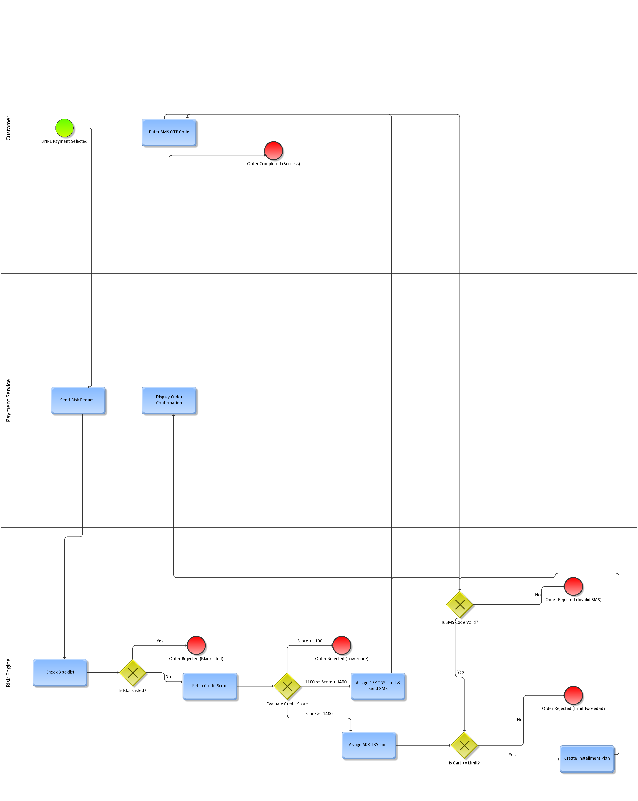
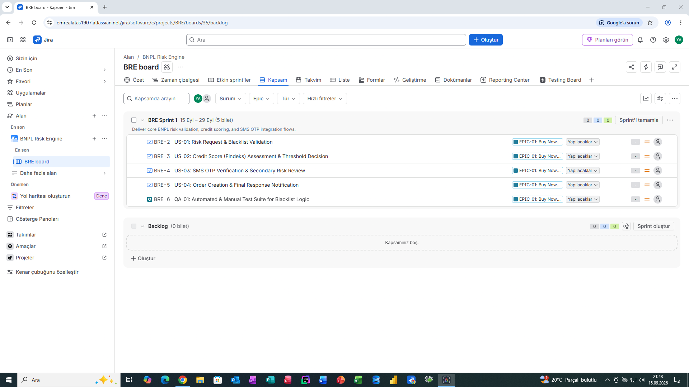

# 💳 BNPL (Buy Now Pay Later) Automated Risk Engine & Process Architecture

## 📌 Project Overview
This repository contains the complete **Business Analysis (BA)**, **BPMN 2.0 Process Architecture**, and **Agile Jira Documentation** for an automated **Buy Now Pay Later (BNPL) Risk Assessment Engine**.

The system evaluates e-commerce customers at checkout through multi-tier automated risk assessments including **Blacklist Verification**, **Findeks Credit Scoring**, and **SMS OTP Authentication** before granting installment options.

---

## 📐 1. Business Process Modeling (BPMN 2.0)
The end-to-end business process was modeled using **BPMN 2.0 standards** in **ARIS Express**, dividing responsibilities across three functional swimlanes:
* **Customer / Checkout UI**
* **BNPL Risk Engine**
* **Third-Party Services** (Findeks Credit Bureau & SMS Gateway)

### 🔑 Key Decision Points (XOR Gateways):
1. **Blacklist Check:** TCKN verification against internal blacklist records.
2. **Credit Score Thresholds:**
   * **Score < 1100:** Auto-rejection (High Risk).
   * **Score 1100 - 1399:** Medium Risk -> Triggers mandatory SMS OTP secondary verification.
   * **Score >= 1400:** Auto-approval (Low Risk) -> Direct contract generation.



---

## 🚀 2. Agile Project Management & Jira Architecture
The project was structured under an **Agile/Scrum framework** in Jira, organizing requirements into a master Epic, User Stories with Gherkin Acceptance Criteria, and QA Test Coverage.

### 🏛️ Epic Structure
* **`EPIC-01`**: Buy Now Pay Later Checkout & Automated Risk Engine Integration



### 📝 User Stories & Acceptance Criteria (Gherkin Syntax)

#### **US-01: Risk Request & Blacklist Validation**
* **Goal:** Verify customer TCKN against the blacklist database immediately upon BNPL selection.
* **Acceptance Criteria:**
  ```gherkin
  Scenario 1: User is Blacklisted (Negative Path)
    Given the customer selects BNPL at checkout
    When the system checks the customer TCKN against the Blacklist DB
    And the TCKN is present in the blacklist
    Then the system must immediately reject the BNPL payment request.

  Scenario 2: User is Clear of Blacklist (Happy Path)
    Given the customer selects BNPL at checkout
    When the system checks the customer TCKN against the Blacklist DB
    And the TCKN is not blacklisted
    Then the system must proceed to Findeks credit score assessment.

US-02: Credit Score Assessment & Threshold Decision
Goal: Query Findeks score service and evaluate against 1100 / 1400 risk thresholds.

US-03: SMS OTP Verification & Secondary Risk Review
Goal: Execute SMS authentication for medium-risk customers (1100 - 1399 Findeks score).

US-04: Order Creation & Final Response Notification
Goal: Generate installment plan (HTTP 200 OK) or return error codes (HTTP 400/403).

🧪 3. Quality Assurance (QA) & Test Integration
To bridge Business Analysis with Software Testing (SDLC), a dedicated Xray Test Suite was created:

QA-01: Automated & Manual Test Suite for Blacklist Logic (Validates HTTP 403 response triggers on blacklisted TCKNs).

🛠️ Tools & Standards Used
Business Process Modeling: ARIS Express (BPMN 2.0)

Agile Management: Jira Software, Scrum, Backlog & Sprint Planning

Requirement Documentation: User Stories, Gherkin Syntax (Given-When-Then)

Test Management: Xray Jira Integration
